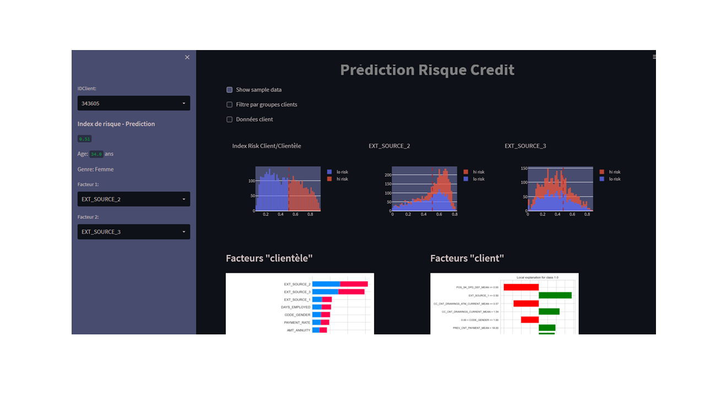

# Prediction-Using-LGB model-streamlit-Web-Application
The appli evaluates a risk index for credit.

<h2>Dependencies for running the web app</h2>

<li>
<ol>joblib==1.0.1</ol>
<ol>numpy==1.22.0</ol>
<ol>pandas==1.2.4</ol>
<ol>plotly==5.6.0</ol>
<ol>requests==2.25.1</ol>
<ol>streamlit==1.10.0</ol>
<ol>lightgbm==3.3.2</ol>
</li>

<h2>Project Folder Structure</h2>

To run the app navigate to https://francoisodavid-applambda-preddef-fdbdlx.streamlitapp.com/

